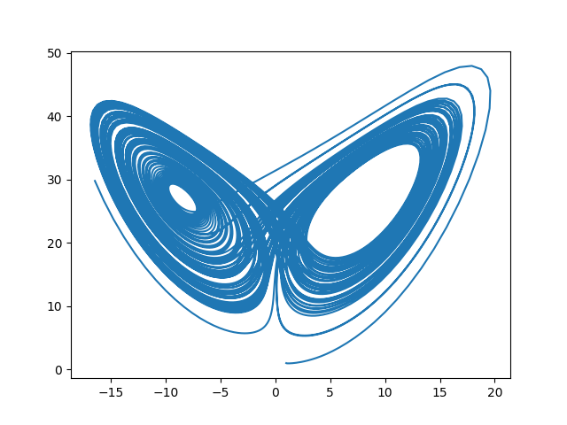
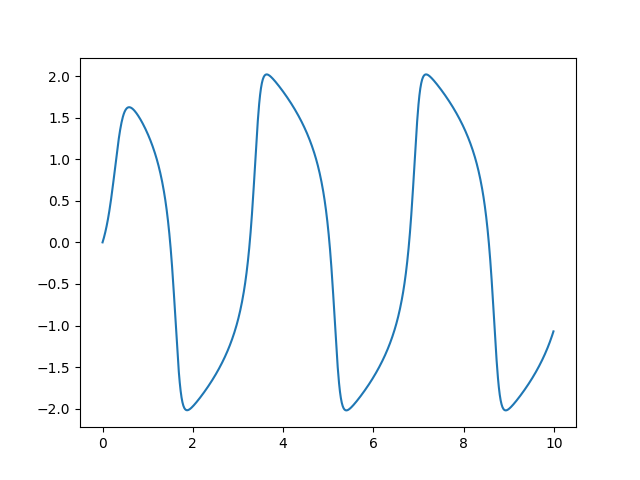
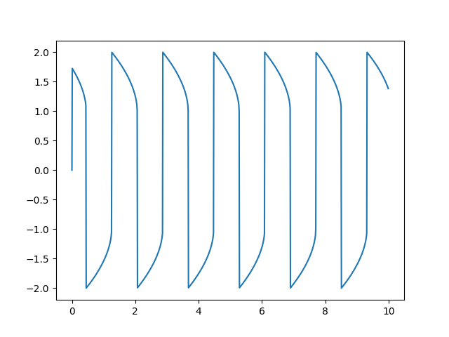

# Introduction

*Symjit* is a lightweight just-in-time (JIT) compiler for *sympy* expressions. It compiles sympy expressions directly into machine code. Its main utility is to generate fast numerical functions to feed into varoious numerical solvers, especially ordinary differential equation (ODE) solvers.   

*Symjit* core is a rust library with minimum external dependency. Specially, it does not use a separate compiler, such as LLVM or gcc. Currently, it can generate AMD64 (aka x86-64) and ARM64 (aka aarch64) machine codes on linux and windows platforms. Further architectures and operating systems (RISC V, aarch64 on Mac OS) are planned.

# Installation

You can install *symjit* using pip command as 

```
pip install symjit
```
or from source by cloning https://github.com/siravan/symjit into `symjit` folder and then running

```
pip install .
```
For the last option, you need a working rust compiler and toolchains, including cargo. 

# Tutorial

## `compile_func`: a replacement for `lambdify`
*symjit* is invoked by calling different `compile_*` functions. The most basic is `compile_func` that behaves similarly to sympy `lambdify` function. However, instead of converting a sympy expression into a regular python function, which in turn calls numpy function, it returns a callable object `BasicFunc`, which is a thin wrapper over the jit code generated by the rust backend. 

A simple example is 

```python
import numpy as np
from symjit import compile_func
from sympy import symbols

x, y = symbols('x y')
f = compile_func([x, y], [x+y, x*y])
assert(np.all(f([3, 5]) == [8., 15.]))
```

`compile_func` takes two mandatory arguments as `compile_func(states, eqs)`. `states` is a list or tuple of symbols. `eqs` is a list or tuple of expressions. If either `states` or `eqs` has only one element, that element can be passed directly. In addition, `compile_func` accepts a named argument `args`, which is a list of symbolic parameters. For example,

```python
x, y, a = symbols('x y a')
f = compile_func([x, y], [(x+y)**a], args=[a])
assert(np.all(f([3, 5], args=[2]) == [64.]))
```

`compile_func` is useful in generating functions to pass to numerical integration (quadrature) routines. The following example is adopted from scipy documentation:

```python
import numpy as np
from scipy.integrate import nquad
from sympy import symbols, exp
from symjit import compile_func

N = 5
t, x = symbols("t x")
f = compile_func([t, x], exp(-t*x)/t**N)

sol = nquad(f, [[1, np.inf], [0, np.inf]])

np.testing.assert_approx_equal(sol[0], 1/N)
```

## `compile_ode` to solve ODEs

`compile_ode` is the second compile function, which returns a compiled function (a callable `OdeFunc`) suitable for passing to `scipy.integrate.solve_ivp` (the main numpy/scipy ODE solver). It takes three mandatory arguments as `compile_ode(iv, states, odes)`. The first one (`iv`) is a single symbol that specifies the independent-variable. `states` is a list of symbols, which defines the ODE state. `odes` is a list of expressions, which define the ODE by providing the derivative of each state variable with respect to the independent variable. In addition, similar to `compile_func`, it can  accept an optional `args`. For example,

```python
# examples/trig.py
import scipy.integrate
import matplotlib.pyplot as plt
import numpy as np
from sympy import symbols
from symjit import compile_ode

t, x, y = symbols('t x y')
f = compile_ode(t, (x, y), (y, -x))
t_eval=np.arange(0, 10, 0.01)
sol = scipy.integrate.solve_ivp(f, (0, 10), (0.0, 1.0), t_eval=t_eval)

plt.plot(t_eval, sol.y.T)
```

Here, the ODE definition is `x' = y` and `y' = -x`, which means `y" = y`. The solution is `a*sin(t) + b*cos(t)`, where `a` and `b` are determined by the initial values. Given the initial values of 0 and 1 passed as the third argument of `solve_ivp`, the solutions are `sin(t)` and `cos(t)`. We can confirm this by running the code. The output is  


Note that `OdeFunc` comforms to the function form `scipy.integrate.solve_ivp` expects, i.e., it should be called as `f(t, y, *args)`.

The next example is more complicated and showcases the [Lorenz system](https://en.wikipedia.org/wiki/Lorenz_system), which is an important milestone in the historical development of chaos theory. 

```python
import numpy as np
from scipy.integrate import solve_ivp
import matplotlib.pyplot as plt
from sympy import symbols

from symjit import compile_ode

t, x, y, z = symbols("t x y z")
sigma, rho, beta = symbols("sigma rho beta")

ode = (
    sigma * (y - x), 
    x * (rho - z) - y, 
    x * y - beta * z
    )

f = compile_ode(t, (x, y, z), ode, params=(sigma, rho, beta))

u0 = (1.0, 1.0, 1.0)
p = (10.0, 28.0, 8 / 3)
t_eval = np.arange(0, 100, 0.01)

sol = solve_ivp(f, (0, 100.0), u0, t_eval=t_eval, args=p)

plt.plot(sol.y[0, :], sol.y[2, :])
```

The result is the famous *strange attractor*:




## `compile_jac` to calculate Jacobian

The ODE examples discussed in the previous section are non-stiff and easy to solve using explicit methods. However, not all differential equations are so accomodating! Many important equations are stiff and usually require implicit methods. Many implicit ODE solvers use the [Jacobian matrix](https://en.wikipedia.org/wiki/Jacobian_matrix_and_determinant) of the system to improve performance. 

There are different techniques to calculate Jacobian. In the last few years, automatic-differention methods working at the level of the abstract syntax tree or lower have gained popularity. However, if we are defining our model symbolically using a Computer Algebra System (CAS) such as sympy, another option is to calculate Jacobian by differentiationg the source symbolic expressions. 

`compile_jac` is the symjit function to calculate Jacobian of an ODE system. It has the same call signature as `compile_ode`, i.e., it is called as `compile_jac(iv, states, odes)` with a optional argument `params`. The return value (of type `JacFunc`) is a callable similar to `OdeFunc`, which returns an n-by-n matrix J, where n is the numner of states. The element at the ith row and jth column of J is the derivative of `odes[i]` with respect to `state[j]` (this is the definition of Jacobian). 

At an example, let's consider the [Van der Pol oscillator](https://en.wikipedia.org/wiki/Van_der_Pol_oscillator). This system has a control parameter (mu). For small values of mu, the ODE system is not stiff and can easily be solved using explicit methods.

```python
import matplotlib.pyplot as plt
import numpy as np
from scipy.integrate import solve_ivp
from sympy import symbols
from math import sqrt
from symjit import compile_ode, compile_jac

t, x, y, mu = symbols('t x y mu')
ode = [y, mu * ((1 - x*x) * y - x)] 

f = compile_ode(t, [x, y], ode, params=[mu])
u0 = [0.0, sqrt(3.0)]
t_eval = np.arange(0, 10.0, 0.01)

sol1 = solve_ivp(f, (0, 10.0), u0, method='RK45', t_eval=t_eval, args=[5.0])

plt.plot(t_eval, sol1.y[0,:])
```

The output is



On the other hand, if mu is increased to 1e6, the system becomes very stiff. Now, an explicit ODE solver, such as RK45 (Runge-Kutta 4/5), is not able to solve this problem. Instead, we need an implciit method, such as backward differentiation formula (BDF). BDF needs a Jacobian. If one is not provided, it numerically calculate one using finite-difference. However, this technique is both inaccurate and computationally intensive. It is much better if we provide a closed-form Jacobian to the solver. As mentioned above, `calculate_jac` exactly does this. 

```python
jac = compile_jac(t, [x, y], ode, params=[mu])
sol2 = solve_ivp(f, (0, 10.0), u0, method='BDF', t_eval=t_eval, args=[1e6], jac=jac)

plot.plot(t_eval, sol2.y[0,:])
```

The output of the stiff system is



# Backends

All `compile_*` functions accepts an optional paramter `ty`, which defines the type of the backend to use. Currently, the possible values are:

* `amd`: generates 64-bit AMD64/x86-64 code. It expects a minimum SSE2.1 spec, which should be easily fulfilled by all except the most ancient processors!
* `arm`: generates 64-bit ARM64/aarch64 code. Specifically, we use 64-bit raspbian on Raspberry Pi 4/5 computers to test this instruction set.
* `bytecode`: this is a generic fast bytecode as a fallback option in case the instruction set is not supported.
* `native` (**default**): selects the correct instruction set based on the current processor.
* `wasm` (**optional**): generates and runs WebAssembly code using wasmtime library. This option is not included in the binary distributions. To enable wasm, you need to make `symjit` from the source and add `features=["wasm"]` to `pyproject.toml`. 

To inspect the generated code, we need to first dump the binary into a file by calling `dump` function of various `Func` callables. For example, call `f.dump('test.bin')`. The resulting file is a flat binary code with no header or other extras. Then, use the disassembler of your choice to inspect the code. For example,

```python
from symjit import compile_func
from sympy import symbols

x, y = symbols('x y')
f = compile_func([x, y], [x+y, x*y])
f.dump('test.bin')
```

On a linux system, we can invoke `objdump` as below:

```
objdump -b binary -m i386:x86-64 -M intel -D test.bin
```

The output is 

```
   0:	55                   	push   rbp
   1:	53                   	push   rbx
   2:	48 89 fd             	mov    rbp,rdi
   5:	48 89 d3             	mov    rbx,rdx
   8:	f2 0f 10 4d 30       	movsd  xmm1,QWORD PTR [rbp+0x30]
   d:	f2 0f 10 45 28       	movsd  xmm0,QWORD PTR [rbp+0x28]
  12:	f2 0f 58 c1          	addsd  xmm0,xmm1
  16:	f2 0f 11 45 38       	movsd  QWORD PTR [rbp+0x38],xmm0
  1b:	f2 0f 10 4d 30       	movsd  xmm1,QWORD PTR [rbp+0x30]
  20:	f2 0f 10 45 28       	movsd  xmm0,QWORD PTR [rbp+0x28]
  25:	f2 0f 59 c1          	mulsd  xmm0,xmm1
  29:	f2 0f 11 45 40       	movsd  QWORD PTR [rbp+0x40],xmm0
  2e:	5b                   	pop    rbx
  2f:	5d                   	pop    rbp
  30:	c3                   	ret    
```
