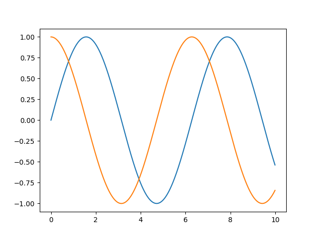

# Introduction

*Symjit* is a lightweight just-in-time (JIT) compiler for *sympy* expressions. It compiles sympy expressions directly into machine code. Its main utility is to generate fast numerical functions to feed into varoious numerical solvers, especially ordinary differential equation (ODE) solvers.   

*Symjit* core is a rust library with minimum external dependency. Specially, it does not use a separate compiler, such as LLVM or gcc. Currently, it can generate AMD64 (aka x86-64) and ARM64 (aka aarch64) machine codes on linux and windows platforms. Further architectures and operating systems (RISC V, aarch64 on Mac OS) are planned.

# Installation

You can install *symjit* using pip command as 

```
pip install symjit
```
or from source by cloning https://github.com/siravan/symjit into a `symjit` folder and then running

```
pip install .
```
For the last option, you need a working rust compiler and toolchains, including cargo. 

# Tutorial

## `compile_func`: a replacement for `lambdify`
*symjit* is invoked by calling different `compile_` functions. The most basic is `compile_func` that behaves similar to sympy `lambdify` function. However, instead of converting a sympy expression into a regular python function calling numpy, it returns a callable object `BasicFunc`, which is a thin wrapper over the jit code generated by the rust backend. For example,

```python
import numpy as np
from symjit import compile_func
from sympy import symbols

x, y = symbols('x y')
f = compile_func([x, y], [x+y, x*y])
assert(np.all(f([3, 5]) == [8., 15.]))
```

`compile_func` takes two mandatory arguments. The first one is a list of symbols. The second is a list of expressions. If any list has only one element, the element can be passed directly. In addition, `compile_func` accepts a named argument `args`, which is a list of symbolic parameters. For example,

```python
x, y, a = symbols('x y a')
f = compile_func([x, y], [(x+y)**a], args=[a])
assert(np.all(f([3, 5], args=[2]) == [64.]))
```

## `compile_ode` to solve ODEs

`compile_ode` is the second compile function, which returns a compiled function (a callable `OdeFunc`) suitable for passing to `scipy.integrate.solve_ivp` (the main numpy/scipy ODE solver). It takes three mandatory arguments. The first one is a single symbol that specifies the indendent-variable (often time for ODEs). The second argument is a list of symbols, which defines the ODE state. The third argument is a list of expressions, which define the ODE by providing the derivative of each state with respect to the independent variable. In addition, similar to `compile_func`, it accepts an optional `args`. For example,

```python
# examples/trig.py
import scipy.integrate
import matplotlib.pyplot as plt
import numpy as np
from sympy import symbols
from symjit import compile_ode

t, x, y = symbols('t x y')
f = compile_ode(t, (x, y), (y, -x))
t_eval=np.arange(0, 10, 0.01)
sol = scipy.integrate.solve_ivp(f, (0, 10), (0.0, 1.0), t_eval=t_eval)

plt.plot(t_eval, sol.y.T)
plt.show()
```

Here, the ODE definition is `x' = y` and `y' = -x`, which means `y" = y`. The solution is `a*sin(t) + b*cos(t)`, where `a` and `b` are determined by the initial values. Given the initial values of 0 and 1 passed as the third argument of `solve_ivp`, the solutions are `sin(t)` and `cos(t)`. We can confirm this by running the code. The output is  



Note that `OdeFunc` comforms to the function form `scipy.integrate.solve_ivp` expects, i.e., it should be called as `f(t, y, *args)`.

# Backends

All `compile_*` functions accepts an optional paramter `ty`, which defines the type of the backend to use. Currently, the possible values are:

* `amd`: generates 64-bit AMD64/x86-64 code. It expects a minimum SSE2.1 spec, which should be easily fulfilled by all except the most ancient processors!
* `arm`: generates 64-bid ARM64/aarch64 code. Specifically, we use 64-bit raspbian on Raspberry Pi 4/5 computers to test this instruction set.
* `bytecode`: this is a generic fast bytecode as a fallback option in case the instruction set is not supported.
* `native` (**default**): selects the correct instruction set based on the current processor.
* `wasm` (**optional**): generates and runs WebAssembly code using wasmtime library. This option is not included in the binary distributions. To enable wasm, you need to make `symjit` from the source and add `features=["wasm"]` to `pyproject.toml`. 

To inspect the generated code, we need to first dump the binary into a file by calling `dump` function of various `Func` callables. For example, call `f.dump('test.bin')`. The resulting file is a flat binary code with no header or other extras. Then, use the disassembler of your choice to inspect the code.   